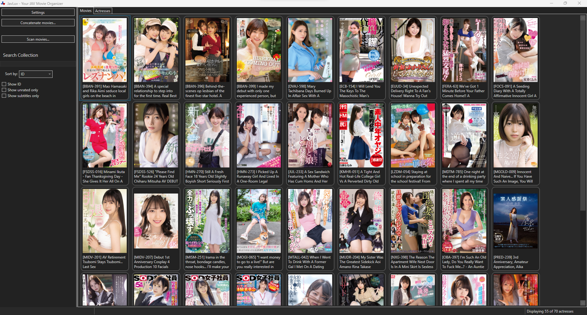
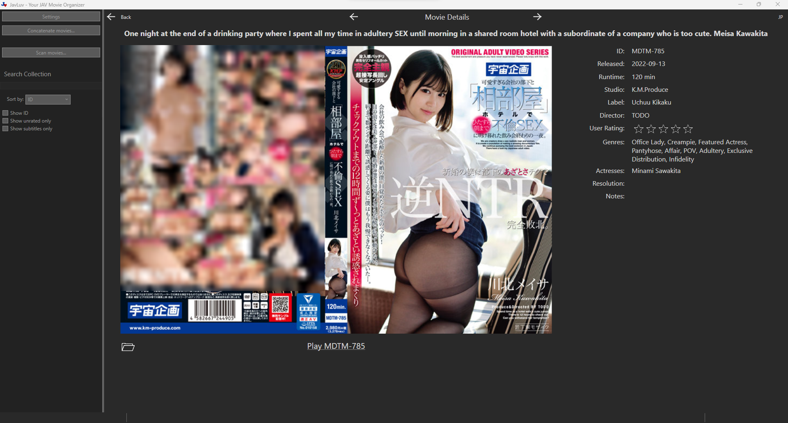
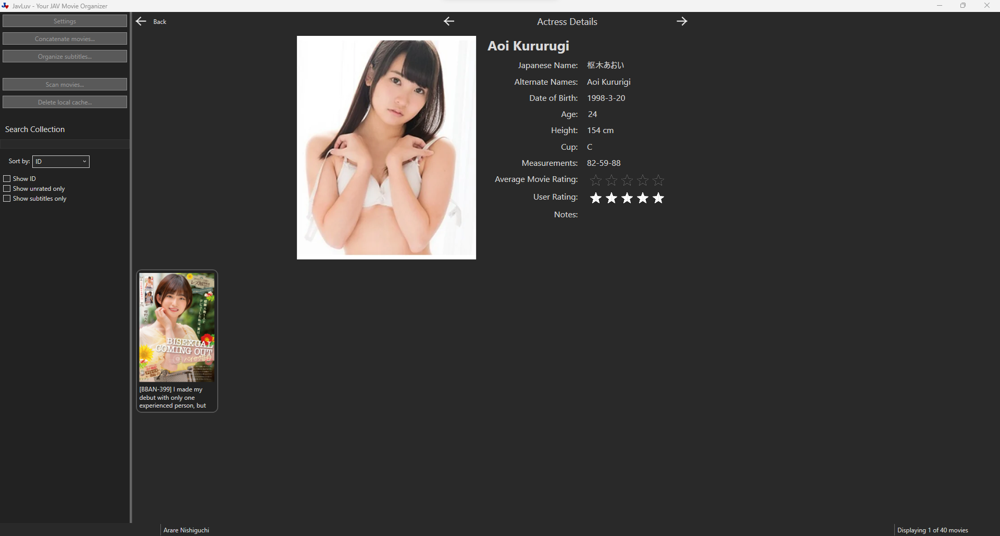

# JavLuv

JavLuv is an application for browsing and organizing your Japanese adult video collection. 

## Requirements

JavLuv runs on Microsoft Windows 10 or later.  You can find the [latest releases here](https://github.com/JavLuv/JavLuv/releases).  To install, simply download and install JavLuv using the msi installer, or unzip and run JavaLuv.exe.

## Features

* Automatic identification of movies by ID embedded in file or folder names
* Generation of Kodi-compatible .nfo metadata
* Automated filtering of most movie metadata
* Visual display of movies and actresses in thumbnail or in details
* Filter instantly by any keywords, such as ID, title, actrees, genres, folder names, etc
* Sort momvies by title, ID, actress, date, and user rating
* Sort actresses by name, age, birthday, movie count, and user rating
* Supports user ratings to identify movie and actress favorites
* Automatic moving / renaming of movie folders and filenames according to configurable rules

## JavLuv Views

JavLuv lets you conveniently view your entire movie collection using the movie browser.  You can search for nearly any metadata to filter the movie collection, like title, genre, actress, and more.  You can also sort by title, ID, actresses, release date (both directsions), and user rating.

_JavLuv movie browser_

 

Double-clicking on a movie in the browser view shows you the movie details view, which displays the movies title, cover, and all associated metadata.

_JavLuv movie details_

 

You can also browse individual actresses in the actress browser by selecting the Actress tab at the top of the page, which are gathered from online sources when you scan movies.  You can sort by name, age (both directions), birthday, number of movies, and user rating.

_JavLuv actress browser_

 

Double-clicking an actress in the actress browser brings you to the actress detail view, where you can see a photo, the actress' name in English and Japanese (including alternate names), various additional information, and a listing of all movies she appears in.

_JavLuv actress details_

## Getting Started

To populate JavLuv with movies, click on the _Scan movies..._ button on the left-hand pane, select a folder with movies in it, and click _Scan_.  Assuming your movies are named correctly, JavLuv will proceed automatically from there.

JavLuv identifies movies by a alpha-numeric code (e.g. \[ABC-123\]) to identify a movie, and then retrieves information from a number of websites to generate metadata for the identified movie.

Metadata is stored in a Kodi-compatible XML file typically named the same as the movie file, but with a .nfo extension.  A local cache of this data is used, but the .nfo metadata is considered to be the authoritative source for the movies.

## Compiling JavLuv

Visual Studio 2022 is required to compile the editor from source.  The Wix plugin is required to compile the installer.  You can build the project by running build.bat in the root folder, after which the installer and zip will be copied to the /build folder.  You can also open the solution in the /src folder and build using Visual Studio's IDE.

## Additional Information

If you want more information about all the features of JavLuv in detail, you can learn about all it on the [JavLuv Wiki](https://github.com/JavLuv/JavLuv/wiki).
